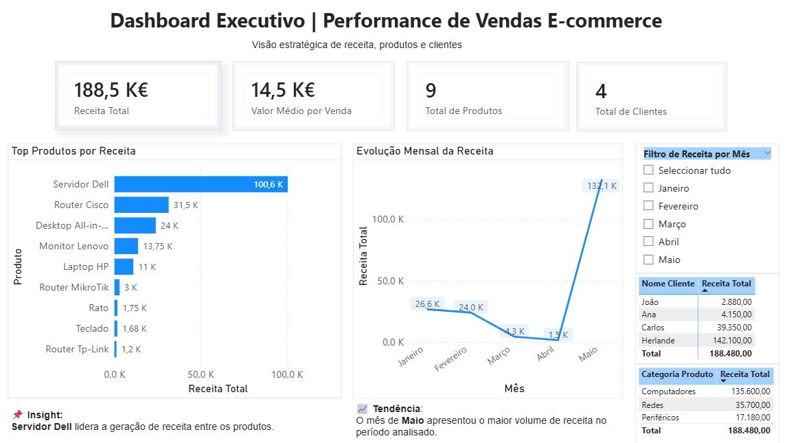

# E-commerce Analytics Dashboard

Dashboard executivo desenvolvido com SQL Server e Power BI.

## Tecnologias
- SQL Server
- Power BI
- DAX
- Star Schema

## Dashboard Preview

## Principais Análises
- Receita total
- Receita por produto
- Receita por mês
- Top clientes
- Ticket médio por venda

## Objetivo
Demonstrar competências em análise de dados, modelagem dimensional e visualização analítica.
